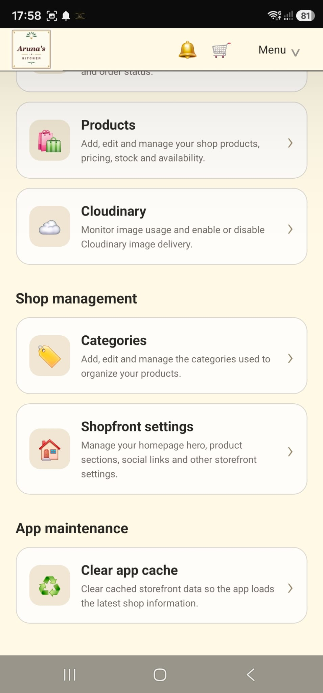
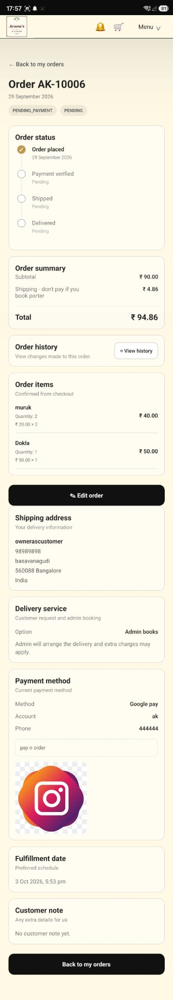
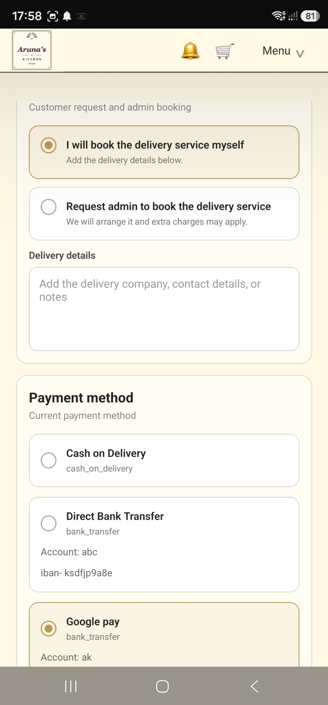
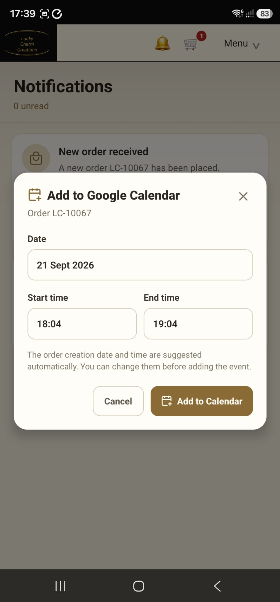
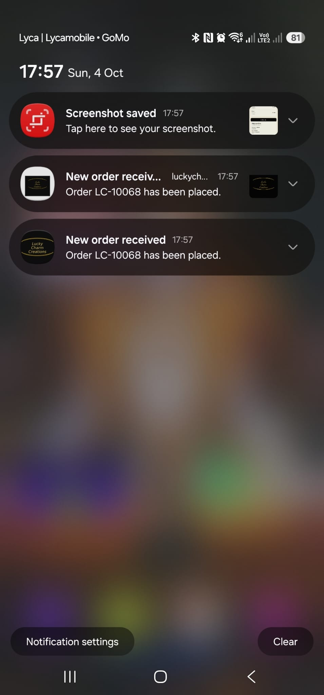
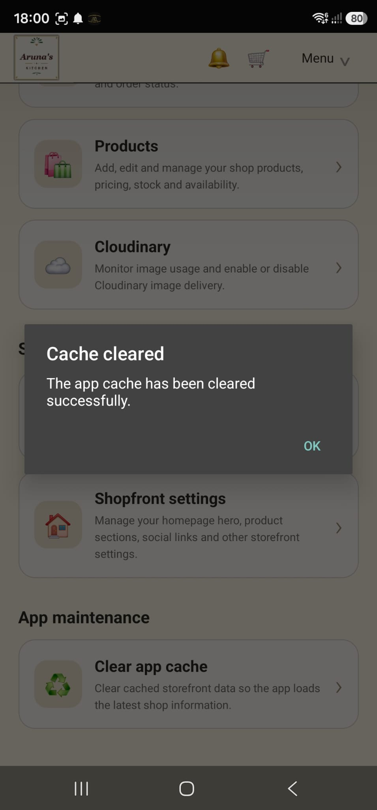
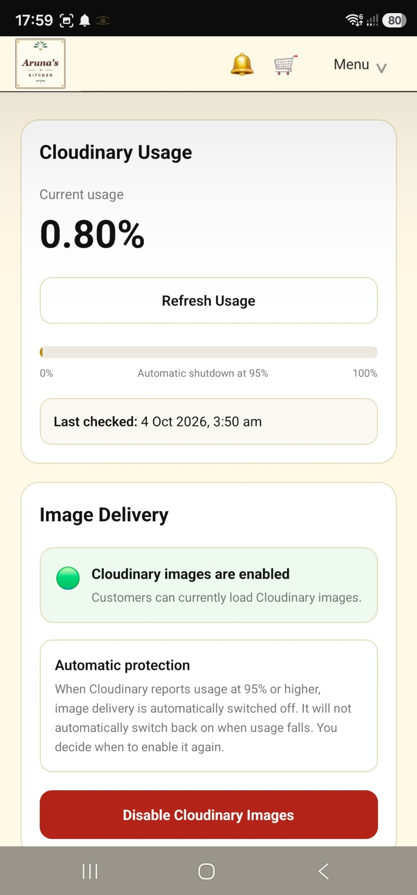

# A Home Cook — Commerce & Order Management Platform

A complete web and Android commerce platform built for a real home-food business.

This project was **independently designed and developed end-to-end by Anupama Rajendra**, covering storefront design, ordering, payments, delivery workflows, customer and admin order editing, history tracking, notifications, authentication, analytics, mobile development, and deployment.

📱 **Mobile Repository:**  
https://github.com/ahomecook12/mobcook

---

## Screenshots

### Admin Experience



Administrative interface for managing store operations, orders, configuration, and business workflows.

---

### Order Management



Detailed order-management workflow showing customer, fulfilment, payment, and delivery information.

---

### Post-Order Editing



Eligible orders can be updated after placement by customers and administrators while preserving the appropriate business rules.

Changes are recorded through the application's history system rather than silently replacing previous information.

---

### Google Calendar Integration



Google Calendar integration allows fulfilment-related order information to be added to the administrator's calendar.

---

### Firebase Messaging



Firebase / mobile messaging support enables order-related notifications and administrative alerts.

---

### Caching & Performance



Administrative cache controls support performance optimisation while allowing important storefront data to be refreshed manually when required.

---

### External Media Protection



Media protection controls allow administrators to disable external image uploads when hosting capacity becomes constrained while keeping the storefront operational.

---

## Project Overview

A Home Cook was built to support the practical day-to-day needs of a small food business.

The system combines:

- customer storefront
- product management
- checkout
- configurable payment methods
- delivery coordination
- customer order editing
- admin order management
- detailed history tracking
- notifications
- Google Calendar integration
- Android application
- caching
- analytics
- cost-conscious infrastructure

The architecture was designed around a strong goal of keeping infrastructure costs at **0 CHF wherever feasible**.

---

## Customer Storefront

Customers can:

- browse products
- search products
- view product information
- add items to cart
- complete checkout
- choose payment method
- choose delivery arrangement
- select preferred fulfilment time
- place orders
- view order details
- edit eligible orders
- review order history

---

## Configurable Payment Methods

The platform supports multiple configurable payment methods including:

- PhonePe
- Google Pay
- Bank Transfer
- Cash on Delivery

Administrators can configure information such as:

- display name
- account name
- phone number
- payment URL
- instructions
- QR code
- active / inactive status
- display order

Customers select one of the currently enabled payment methods during checkout.

A snapshot of the selected payment information is stored with the order so historical orders remain accurate even if store settings change later.

---

## Delivery / Porter Workflow

Delivery handling supports two customer choices:

### Customer Books Delivery

The customer arranges the delivery service directly and can store relevant delivery information.

### Request Admin to Book

The customer asks the business administrator to arrange delivery.

Delivery information can be updated while the order is still eligible for editing.

---

## Post-Order Editing

One of the key features of the platform is the ability to edit certain order information after the order has been placed.

Depending on order status, customers can update information such as:

- shipping information
- delivery choice
- delivery details
- preferred fulfilment date
- notes

Administrators can also update relevant order information.

This supports the reality of small-business ordering, where details sometimes need to be adjusted after checkout.

---

## Historical Change Tracking

Order information is not simply overwritten.

The application records change history so previous values remain visible.

History is maintained for areas such as:

- order changes
- payment information
- delivery / porter information

Each history entry can contain:

- change type
- who made the change
- previous value
- new value
- description
- timestamp

This creates a clear audit trail for both the business and customer.

---

## Notifications

When customers modify an existing order, administrators can be notified.

Notifications include workflows such as:

- new order
- customer order changes
- order updates
- administrative attention required

Mobile notification support is built using Firebase / Expo notification infrastructure.

---

## Google Calendar Integration

Orders can be connected to Google Calendar workflows.

This helps the business manage fulfilment dates and planned orders outside the application itself.

The integration supports Google account selection and OAuth-based calendar access.

---

## Authentication

The platform supports user authentication and protected customer/admin areas.

Authentication features include:

- email login
- Google authentication
- password recovery
- user profiles
- customer / admin roles

---

## Product & Category Management

Administrators can:

- create products
- edit products
- manage product availability
- assign categories
- manage product images
- configure display settings
- manage stickers / labels
- control whether products are available for sale

---

## Catalogue Mode

The storefront can operate in a configurable catalogue mode.

This allows the business to:

- display products publicly
- hide public pricing when required
- continue customer enquiry / ordering workflows
- discuss pricing privately where appropriate

---

## YouTube Content

Products can include separate YouTube post links.

The platform intentionally uses links rather than automatically loading heavy video previews everywhere in order to reduce unnecessary traffic.

---

## Media Protection

The project includes controls for external image hosting usage.

Administrators can disable image uploads when media hosting capacity is unavailable or reaches a configured limit.

Existing image URLs remain stored while the application can fall back to safe placeholder behaviour.

This allows the storefront to continue operating even when an external image service becomes constrained.

---

## Caching

Caching is used to improve performance and reduce backend traffic.

Frequently requested storefront and product data can be cached with controlled revalidation.

The admin dashboard includes manual cache-clearing functionality when an immediate refresh is needed.

---

## Analytics

The application includes basic analytics such as:

- visitor sessions
- page views
- monthly statistics
- storefront activity

---

## Mobile Application

A Home Cook also includes an Android application.

The mobile app supports customer workflows and selected administrative functionality.

Built with:

- React Native
- Expo
- Expo Router

Mobile repository:

https://github.com/ahomecook12/mobcook

---

## Technology Stack

### Web

- Next.js
- React
- TypeScript
- Tailwind CSS

### Backend & Data

- Supabase
- PostgreSQL
- Row Level Security
- Application APIs

### Mobile

- React Native
- Expo
- Expo Router

### Authentication

- Supabase Auth
- Google OAuth
- Email Authentication

### Notifications

- Firebase
- Expo Notifications

### Integration

- Google Calendar
- YouTube links

### Deployment

- Vercel

---

## High-Level Architecture

```text
Customer / Admin
      ↓
Next.js Web Application
      ↓
Application APIs
      ↓
Supabase
 ├── Authentication
 ├── PostgreSQL
 ├── Orders
 ├── Products
 ├── Payments
 ├── Delivery
 ├── History
 └── Notifications
```

Additional integrations:

```text
Firebase / Expo → Push notifications
Google Calendar → Fulfilment scheduling
YouTube         → External media
```

The Android application uses the same business ecosystem.

---

## Order Lifecycle

A typical flow is:

```text
Customer Creates Order
        ↓
Payment Pending
        ↓
Processing
        ↓
Delivery Coordination
        ↓
Shipped
        ↓
Delivered
```

Eligible orders can be edited before later fulfilment stages.

Changes are recorded rather than silently replacing previous information.

---

## Cost-Conscious Architecture

The client required a very low-cost infrastructure approach.

The application was therefore designed around a **0 CHF infrastructure target wherever feasible**.

Engineering decisions included:

- free-tier hosting
- controlled media usage
- caching
- external video links
- usage protection
- efficient backend access
- manual cache invalidation
- avoiding unnecessary paid infrastructure

---

## Running Locally

### 1. Clone the repository

```bash
git clone https://github.com/ahomecook12/webcook.git
```

### 2. Enter the project

```bash
cd webcook
```

### 3. Install dependencies

```bash
npm install
```

### 4. Configure environment variables

Create the required local environment file containing the application's service configuration.

Do not commit private credentials or `.env` values to GitHub.

### 5. Start development

```bash
npm run dev
```

### 6. Production build

```bash
npm run build
```

---

## Development

**Independent end-to-end development by Anupama Rajendra**

Responsibilities included:

- application architecture
- database design
- authentication
- customer storefront
- checkout
- payment configuration
- delivery workflows
- editable orders
- order history
- admin tools
- notification architecture
- Google Calendar integration
- mobile integration
- caching
- deployment
- infrastructure cost management

---

## Developer

**Anupama Rajendra**

Software Engineer  
**Java · SQL · Unix / Shell Scripting · Enterprise Integration · Full-Stack · Mobile**

Portfolio:  
https://A-nu-1.github.io/anupamaportfolio/

GitHub:  
https://github.com/A-nu-1

---

## Related Repository

### Android App

https://github.com/ahomecook12/mobcook

---

## Project Status

This is a real client application built for a home-food business.

The repository documents the engineering behind the complete customer, admin, payment, delivery and order-management workflow.